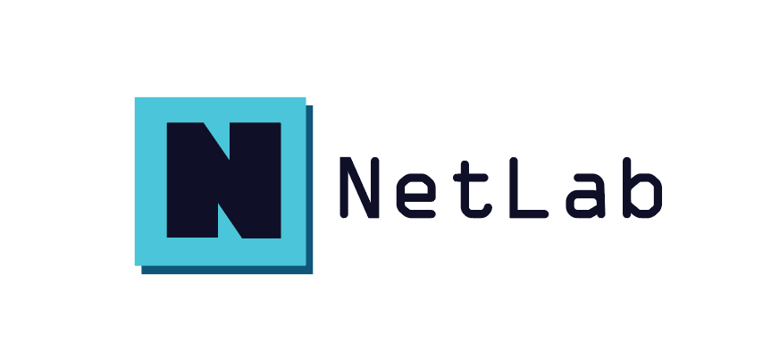

    

# NetLab

### แพลตฟอร์มใช้งาน GNS3 VM บน Amazon Web Services

ระบบที่สามารถขอสร้าง GNS3 VM บน Cloud ผ่านหน้าเว็บไซต์ และเข้าใช้งาน VM ที่ได้รับผ่าน EC2 บน AWS โดยไม่ต้องติดตั้ง GNS3 VM ลงเครื่องคอมพิวเตอร์ รวมทั้งสามารถเพิ่ม Image อย่าง IOS หรือ QEMU เข้าไปใน GNS3 VM บน Cloud ได้

## เอกสารคู่มือสำหรับการ Develop

- 🎨 [เอกสารการพัฒนาฝั่ง Frontend](frontend/README.md)
- 🗄️ [เอกสารการพัฒนาฝั่ง Backend](backend/README.md)

## เอกสารคู่มือสำหรับการ Deploy
- 📖 [คู่มือการติดตั้งและ Deploy Backend บน Amazon ECR และ AWS ECS](backend/README.md#ส่วนที่-2b-การ-deploy-ไปยัง-amazon-ecr-และ-aws-ecs-fargate)
- 🐳 [Dockerfile สำหรับ Backend](backend/Dockerfile)
