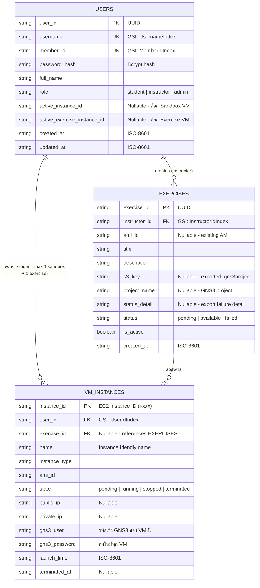

# GNS3 Cloud - NetLab Backend API

FastAPI backend สำหรับระบบ **NetLab** ให้นักศึกษาแขนง Infrastructure ขอสร้างและควบคุม GNS3 VM บน AWS EC2 ผ่านเว็บไซต์ พร้อมระบบจัดการผู้ใช้, อินสแตนซ์ และแบบฝึกหัด Lab ด้วย **Amazon DynamoDB (Reduced Schema)**, ระบบความปลอดภัย **JWT Authentication**, สิทธิ์ตามบทบาท (`student` / `instructor` / `admin`) และโควตา VM แบบ Atomic

---

## 📑 สารบัญ

- [ฟีเจอร์หลัก](#-ฟีเจอร์หลักของระบบ)
- [โครงสร้างฐานข้อมูล](#️-โครงสร้างฐานข้อมูล-dynamodb-reduced-schema)
- [คำแนะนำสำหรับ AWS Academy Learner Lab](#️-คำแนะนำสำหรับ-aws-academy-learner-lab)
- [ส่วนที่ 0: Quick Start ด้วย Bootstrap Scripts (แนะนำ)](#ส่วนที่-0-quick-start-ด้วย-bootstrap-scripts-แนะนำ)
- [ส่วนที่ 1: ติดตั้งและรัน Local Backend (ตั้งค่าเอง)](#ส่วนที่-1-การติดตั้งและรัน-local-backend-ตั้งค่าเอง)
- [การทดสอบระบบ](#-การทดสอบระบบ-automated-tests)
- [API](#api)
- [ส่วนที่ 3: Deploy ไปยัง Amazon ECR และ AWS ECS (Fargate)](#ส่วนที่-3-การ-deploy-ไปยัง-amazon-ecr-และ-aws-ecs-fargate)
- [มาตรการความปลอดภัย](#-มาตรการความปลอดภัยและคำแนะนำ)

---

## 🚀 ฟีเจอร์หลักของระบบ

1. **Authentication & User Management (DynamoDB)**
   - ลงชื่อเข้าใช้ด้วย Username หรือ Member ID พร้อมรหัสผ่านที่เข้ารหัสด้วย `bcrypt`
   - ออก **JWT (HS256)** รองรับทั้ง `Authorization: Bearer <token>` และ `HttpOnly Cookie` (ออกจากระบบด้วย `POST /auth/logout`)
   - แบ่งสิทธิ์: `student`, `instructor`, `admin`
   - Admin จัดการผู้ใช้ผ่าน API ได้ครบ (สร้าง / ดูรายชื่อ / แก้ไข / ลบ) และมี Dashboard ภาพรวม
   - มีสคริปต์ CLI สำหรับสร้างบัญชี (`scripts/create_user.py`)
2. **EC2 & VM Lifecycle with DynamoDB Persistence**
   - **โควตา VM ตามบทบาท** (ป้องกัน Race Condition ด้วย DynamoDB Conditional Write):
     | บทบาท | สิทธิ์สร้าง VM |
     |---|---|
     | `student` | **Sandbox 1 เครื่อง + Exercise 1 เครื่อง** (ล็อกแยกกัน) |
     | `instructor` | ไม่จำกัดจำนวน |
     | `admin` | สร้าง VM ไม่ได้ (ดู Dashboard / จัดการผู้ใช้เท่านั้น) |
   - จำกัดจำนวน VM ของทั้งโปรเจกต์ด้วย `MAX_CONCURRENT_INSTANCES`
   - **รหัสผ่าน GNS3 แยกต่อ VM**: ตอน launch ระบบสุ่มรหัสผ่านใหม่ใส่ผ่าน EC2 UserData แล้วเก็บใน DynamoDB ส่งให้เจ้าของ VM เท่านั้น (Admin ไม่เห็น)
   - Real-time sync สถานะและ Public IP จาก EC2 เข้า DynamoDB (Start แล้วรอ `running` เพื่อได้ IP ใหม่, Stop แล้วเคลียร์ IP)
   - Ownership Protection: Start / Stop / Terminate ได้เฉพาะ VM ของตัวเอง (Admin ทำได้ทุกเครื่อง)
   - คืนโควตาทันทีเมื่อ Terminate
3. **Lab Exercises Management**
   - Instructor สร้างแบบฝึกหัดได้ 2 แบบ: **Export โปรเจ็ค GNS3 จาก VM ของตัวเองเป็นไฟล์ `.gns3project` และเก็บใน private S3 bucket** (สถานะ `pending` → `available` หรือ `failed`) หรือระบุ `ami_id` ที่มีอยู่แล้ว
   - นักศึกษาเลือก `exercise_id` ตอนขอสร้าง VM เพื่อเริ่มจากโจทย์/Topology นั้นทันที เมื่อ S3 export สำเร็จ VM จะ import โปรเจ็คตอน first boot
   - Instructor ทุกคนลบแบบฝึกหัดของกันและกันได้ (และ Admin) เมื่อลบ ระบบจะ **terminate VM ทุกเครื่องที่สร้างจากแบบฝึกหัดนั้น** (`exercise_id` เดียวกัน) พร้อมคืนโควตา แล้วจึง De-register AMI / ลบไฟล์บน S3 / ลบแถวใน DynamoDB ผู้ที่กำลังทำแล็บนั้นอยู่จะเสียงานที่ยังไม่ได้บันทึกทันที
   - ระบบไม่ De-register AMI หลัก (`DEFAULT_AMI_ID`) แม้มีคนสร้างแบบฝึกหัดโดยใส่ `ami_id` นั้น
4. **Automated Provisioning & Verification**
   - `scripts/bootstrap_aws.py` ตั้งค่า AWS + `.env` ให้ครบในคำสั่งเดียว
   - `scripts/build_gns3_ami.py` สร้าง GNS3 Base AMI จากศูนย์แบบอัตโนมัติ
   - `scripts/share_ami.py` แชร์ AMI ให้เพื่อนร่วมทีม
   - `scripts/init_dynamodb.py` สร้างตาราง DynamoDB (On-Demand)
   - `scripts/test_flow.py` ชุดทดสอบ 33 เคส (ไม่ต้องใช้ AWS จริง)
   - API reference และตัวอย่าง Request/Response อยู่ในส่วนที่ 2 ของเอกสารนี้

---

## 🗄️ โครงสร้างฐานข้อมูล DynamoDB (Reduced Schema)

ใช้ 3 ตารางแบบ On-Demand (`PAY_PER_REQUEST`):



---

## ⚠️ คำแนะนำสำหรับ AWS Academy Learner Lab

โปรเจกต์นี้รองรับทั้ง **AWS Academy Learner Lab** และ **AWS Account จริงทั่วไป**:

- **AWS Learner Lab**
  - ล็อก Region `us-east-1` (N. Virginia)
  - Credentials มีอายุ ~3-4 ชั่วโมง (มี `aws_session_token`)
  - **สร้าง IAM Role / IAM User เองไม่ได้** ต้องใช้ `LabRole` / `LabInstanceProfile` ที่ Lab เตรียมไว้
  - มี **default VPC + Internet Gateway + public subnet** ให้อยู่แล้ว ไม่ต้องสร้างเอง
  - ต้องคัดลอกค่าจาก **AWS Details** ทุกครั้งที่เปิด Session ใหม่ (ถ้าใช้ `bootstrap_aws.py --write-credentials` สคริปต์จะเขียนลง `.env` ให้)
  - Budget จำกัด **ควร Stop / Terminate VM ทุกครั้งที่เลิกใช้งาน**
- **AWS Account จริง**
  - ลบบรรทัด `AWS_SESSION_TOKEN` ใน `.env` ได้
  - เลือก Region ได้อิสระ เช่น `ap-southeast-1` และสร้าง IAM Role เองตาม least-privilege

ในโค้ดจุดที่ต่างกันระหว่าง Lab กับ Account จริงจะมีคอมเมนต์ `>>> LEARNER LAB ONLY <<<` กำกับใน `app/config.py`

---

## ส่วนที่ 0: Quick Start ด้วย Bootstrap Scripts (แนะนำ)

ถ้าไม่อยากสร้าง Security Group, Key Pair, GNS3 AMI และไฟล์ `.env` ด้วยมือ ให้ใช้ 3 สคริปต์ในโฟลเดอร์ `scripts/` (เขียนด้วย `boto3` รันซ้ำได้ปลอดภัย):

| สคริปต์ | หน้าที่ | ใครรัน |
|---|---|---|
| `bootstrap_aws.py` | หา default VPC, สร้าง Security Group + Key Pair, หา Instance Profile, หา/copy AMI, เขียน `.env`, (ตัวเลือก) สร้างตาราง + ผู้ใช้ Admin | **ทุกคน** |
| `build_gns3_ami.py` | สร้าง GNS3 Base AMI จากศูนย์ (เปิด builder VM ชั่วคราว → ติดตั้ง GNS3 → ทดสอบ → สร้าง AMI → terminate builder) | คนที่ยังไม่มี AMI |
| `share_ami.py` | แชร์ AMI (และ Snapshot) ให้ AWS Account ของเพื่อน | เจ้าของ AMI |

### สิ่งที่ต้องมีก่อน
- Python 3.11+ และติดตั้ง dependencies แล้ว (`pip install -r requirements.txt`)
- Start Lab แล้วก็อป credentials จาก **AWS Details** ไปวางที่ `~/.aws/credentials` (Windows: `C:\Users\<ชื่อ>\.aws\credentials`):
  ```ini
  [default]
  aws_access_key_id=ASIA...
  aws_secret_access_key=...
  aws_session_token=IQoJ...
  ```
- รันทุกคำสั่งจากโฟลเดอร์ `backend/`

### ขั้นตอนสำหรับเพื่อนร่วมทีม (ทางลัด: เจ้าของโปรเจกต์แชร์ AMI ให้)

1. หา Account ID ของตัวเองแล้วส่งให้เจ้าของโปรเจกต์:
   ```bash
   aws sts get-caller-identity --query Account --output text
   ```
2. เจ้าของรัน `python scripts/share_ami.py <AMI_ID> <ACCOUNT_ID_เพื่อน>` (ดูหัวข้อ "สำหรับเจ้าของ AMI" ด้านล่าง)
3. เพื่อนรันคำสั่งเดียว (copy AMI เข้า Account ตัวเอง + ตั้งค่าทุกอย่าง + สร้างตาราง):
   ```bash
   python scripts/bootstrap_aws.py --copy-ami <AMI_ID> --write-credentials --init-db
   ```
4. รันเซิร์ฟเวอร์:
   ```bash
   uvicorn app.main:app --reload --host 0.0.0.0 --port 8000
   ```

> ⚠️ `--copy-ami` สร้าง AMI สำเนาใหม่ **ทุกครั้งที่รัน** ให้ใช้แค่ครั้งแรก ครั้งต่อไปรัน `python scripts/bootstrap_aws.py --write-credentials` เฉยๆ สคริปต์จะหา AMI ชื่อ `netlab-gns3-base*` ใน Account ให้เอง

### ขั้นตอนสำหรับคนที่ยังไม่มี AMI (สร้างเองจากศูนย์ ไม่พึ่ง Account ใคร)

```bash
python scripts/bootstrap_aws.py --write-credentials --init-db   # สร้าง SG, Key Pair, .env, ตาราง
python scripts/build_gns3_ami.py --write-env                    # สร้าง AMI (~10-20 นาที) แล้วเขียน DEFAULT_AMI_ID ลง .env
uvicorn app.main:app --reload --host 0.0.0.0 --port 8000
```

`build_gns3_ami.py` ทำสิ่งเหล่านี้ให้:
1. หา Ubuntu 24.04 AMI ล่าสุดของ Canonical
2. เปิด builder VM (`t3.medium`, disk 16 GB) พร้อม UserData ที่ติดตั้ง `gns3-server` จาก PPA ทางการ (`ppa:gns3/ppa`) + `docker.io` (มี QEMU / Dynamips / uBridge / VPCS มากับแพ็กเกจ), ตั้ง `gns3_server.conf` (เปิด auth, port 3080, console 5900-5999) และติดตั้ง systemd service `gns3-server`
3. builder ทดสอบเรียก `/v2/version` (ต้องได้ `200` เมื่อใส่รหัส และ `401` เมื่อไม่ใส่) ผ่านแล้วพิมพ์ `NETLAB_BUILD_OK` ลง console แล้วปิดเครื่อง
4. สคริปต์อ่าน console → สร้าง AMI → **terminate builder** ทิ้ง (ไม่เสียเครดิตต่อ)
5. ล้างไฟล์ log / UserData / SSH keys ก่อนทำ AMI รหัสผ่าน GNS3 ใน AMI เป็นค่าสุ่มชั่วคราว และถูกแทนที่ด้วยรหัสใหม่ของแต่ละ VM ตอน launch

ตัวเลือกที่มีประโยชน์:
```bash
python scripts/build_gns3_ami.py --print-userdata     # ดูสคริปต์ติดตั้งโดยไม่เรียก AWS
python scripts/build_gns3_ami.py --keep-builder       # ถ้า build พัง ไม่ terminate builder ไว้ดีบั๊ก
python scripts/build_gns3_ami.py --instance-type t3.large --volume-gb 24 --name my-gns3-ami
```

### สำหรับเจ้าของ AMI: แชร์ให้เพื่อน
```bash
python scripts/share_ami.py ami-0123456789abcdef0 111122223333 444455556666
```
สคริปต์เพิ่ม Launch Permission ให้ AMI และ Snapshot ของมัน (ใช้ได้เมื่อ AMI ไม่ถูกเข้ารหัสด้วย KMS key ส่วนตัว) เพื่อนต้อง **copy เข้า Account ตัวเอง** (ผ่าน `--copy-ami`) เพราะถ้า Learner Lab ของเจ้าของถูกรีเซ็ต AMI ต้นทางจะหายไป

### ตัวเลือกของ `bootstrap_aws.py`

| Option | ความหมาย |
|---|---|
| `--write-credentials` | ก็อป credentials ปัจจุบัน (รวม session token) ลง `.env` ใช้ทุกครั้งที่เปิด Lab session ใหม่ |
| `--init-db` | รัน `init_dynamodb.py --seed` (สร้างตาราง + บัญชี Admin) |
| `--copy-ami ami-xxx` | copy AMI ที่เพื่อนแชร์มาเข้า Account ตัวเอง |
| `--ami-id ami-xxx` | ใช้ AMI ที่อยู่ใน Account ตัวเองอยู่แล้ว |
| `--ssh-cidr 1.2.3.4/32` / `--no-ssh` | กำหนด IP ที่ SSH ได้ / ไม่เปิด port 22 (ค่าเริ่มต้น: IP ปัจจุบันของคุณ) |
| `--instance-type t3.medium` | ตั้ง `DEFAULT_INSTANCE_TYPE` ใน `.env` |
| `--region`, `--env-file` | เปลี่ยน Region (ค่าเริ่มต้น `us-east-1`) / path ของ `.env` |

สิ่งที่ `bootstrap_aws.py` ทำให้:
- สร้าง Security Group `netlab-gns3-vm-sg` (เปิด `3080`, `5900-5999` และ `22` เฉพาะ IP คุณ)
- สร้าง Key Pair `gns3-cloud-keypair` และบันทึก `gns3-cloud-keypair.pem` ไว้ในโฟลเดอร์ `backend/` (AWS ให้ private key ครั้งเดียวตอนสร้าง)
- หา Instance Profile (`LabInstanceProfile`) แล้วใส่ `INSTANCE_PROFILE_NAME`
- สุ่ม `JWT_SECRET_KEY` ให้ถ้ายังเป็นค่าตัวอย่าง
- อัปเดตเฉพาะ key ที่เกี่ยวข้องใน `.env` ไม่แตะบรรทัดอื่น

> หลังรัน `--init-db` จะได้บัญชี Admin ทดสอบ: **username `admin` / Member ID `ADMIN01` / password `test1234`** (เปลี่ยนรหัสด้วยตัวแปร `SEED_PASSWORD` ก่อนรัน) แล้วใช้ Admin สร้าง Instructor / Student ผ่าน `POST /admin/users` หรือ `scripts/create_user.py`

---

## ส่วนที่ 1: การติดตั้งและรัน Local Backend (ตั้งค่าเอง)

> ข้ามส่วนนี้ได้ถ้าใช้ [ส่วนที่ 0](#ส่วนที่-0-quick-start-ด้วย-bootstrap-scripts-แนะนำ) แล้ว

### 1. ติดตั้ง Dependencies
```bash
cd backend
python3 -m venv venv
source venv/bin/activate        # Windows: venv\Scripts\activate
pip install -r requirements.txt
```

### 2. ตั้งค่าไฟล์ Environment (.env)
```bash
cp .env.example .env
```
กรอกค่าใน `.env` ให้ตรงกับ resource ใน AWS Account ของคุณ โดยชื่อตัวแปรด้านล่างตรงกับ `backend/.env.example`:

| ตัวแปร | ใช้สำหรับ / ค่าเริ่มต้น |
|---|---|
| `AWS_ACCESS_KEY_ID`, `AWS_SECRET_ACCESS_KEY` | AWS credentials สำหรับเรียก EC2, DynamoDB และ S3; ถ้าใช้ Instance Profile ไม่ต้องใส่ |
| `AWS_SESSION_TOKEN` | ใช้เฉพาะ credentials ชั่วคราวของ AWS Academy Learner Lab; Account ปกติปล่อยว่างหรือลบบรรทัดนี้ได้ |
| `AWS_REGION` | Region ของ AWS; ตัวอย่างใน `.env.example` คือ `us-east-1` |
| `DEFAULT_AMI_ID` | AMI ที่ติดตั้ง GNS3 แล้ว ใช้เป็น Base AMI ตอนสร้าง VM |
| `DEFAULT_INSTANCE_TYPE` | EC2 instance type; ตัวอย่างคือ `t2.micro` |
| `DEFAULT_KEY_NAME` | ชื่อ EC2 Key Pair ที่มีอยู่ใน Region เดียวกัน |
| `DEFAULT_SECURITY_GROUP_ID` | Security Group ID ของ GNS3 VM |
| `INSTANCE_PROFILE_NAME` | Instance Profile ที่แนบกับ GNS3 VM; ตัวอย่างใน `.env.example` คือ `LabRole` |
| `MAX_CONCURRENT_INSTANCES` | จำนวน VM สูงสุดของทั้งระบบ; ตัวอย่างคือ `3` |
| `USERS_TABLE_NAME`, `INSTANCES_TABLE_NAME`, `EXERCISES_TABLE_NAME` | ชื่อตาราง DynamoDB; ตัวอย่าง `netlab_users`, `netlab_instances`, `netlab_exercises` |
| `DYNAMODB_ENDPOINT_URL` | ไม่บังคับ; ใช้ระบุ endpoint เช่น `http://localhost:8000` สำหรับ local DynamoDB |
| `SNAPSHOTS_BUCKET` | ชื่อ private S3 bucket ที่เก็บไฟล์ `.gns3project`; ต้องตั้งค่าหากสร้าง Exercise ด้วยการ export จาก GNS3 |
| `SNAPSHOTS_PREFIX` | Prefix ของ object ใน bucket; ค่าใน `.env.example` คือ `exercises` |
| `SNAPSHOT_URL_EXPIRES` | อายุ presigned URL เป็นวินาที; ค่าใน `.env.example` คือ `3600` |
| `GNS3_API_PORT` | Port ของ GNS3 REST API บน VM อาจารย์; ค่าใน `.env.example` คือ `3080` |
| `GNS3_PREFER_PRIVATE_IP` | เลือก IP ที่ backend ใช้เชื่อมต่อ GNS3 ก่อน; `false` เหมาะเมื่อ backend รันนอก VPC |
| `GNS3_EXPORT_TIMEOUT` | Timeout สำหรับ export โปรเจ็คเป็นวินาที; ค่าใน `.env.example` คือ `1800` |
| `JWT_SECRET_KEY` | Secret สำหรับลงนาม JWT; เปลี่ยนจากค่าตัวอย่างเป็นค่าสุ่มที่ไม่ซ้ำ |
| `JWT_ALGORITHM` | Algorithm ของ JWT; ตัวอย่างคือ `HS256` |
| `JWT_EXPIRE_MINUTES` | อายุ JWT เป็นนาที; ตัวอย่างคือ `1440` |

ค่าตัวอย่างใน `.env.example` เป็น placeholders ไม่ใช่ credentials หรือ resource IDs ที่ใช้งานได้จริง. การสร้าง Exercise แบบ S3 ต้องมี bucket อยู่แล้วและ AWS identity ของ backend ต้องมีสิทธิ์อ่าน/เขียน object ใน bucket. ตัวแปร `GNS3_SET_VM_PASSWORD`, `GNS3_VM_USER`, `GNS3_CONFIG_PATH` และ `GNS3_SERVICE_NAME` มีค่า default ใน `app/config.py` แต่ไม่ได้อยู่ใน `.env.example`.

> ⚠️ ตัวอย่างขนาดเครื่อง `t2.micro` เหมาะกับทดสอบเท่านั้น ถ้า GNS3 ช้าหรือรัน node ไม่ไหว ให้เพิ่มเป็น `t3.medium` ขึ้นไป (`--instance-type t3.medium` ของ `bootstrap_aws.py`)

### 3. สร้างตาราง DynamoDB (ครั้งแรกครั้งเดียว รันซ้ำได้ปลอดภัย)
```bash
python scripts/init_dynamodb.py           # สร้างเฉพาะตาราง (เพิ่ม GSI ที่ขาดให้ถ้าตารางมีอยู่แล้ว)
python scripts/init_dynamodb.py --seed    # + สร้างบัญชี Admin ทดสอบ (admin / ADMIN01 / test1234)
```

### 4. สร้างบัญชีผู้ใช้ (Admin / Instructor / Student)
```bash
python scripts/create_user.py -u admin -m 0000000 -p AdminPass123! -r admin -n "System Admin"
python scripts/create_user.py -u instructor01 -m INST01 -p InstPass123! -r instructor -n "Ajarn Somchai"
python scripts/create_user.py -u student01 -m 6410001 -p StudentPass123! -r student -n "Somchai Student"
```
หรือ Login เป็น Admin แล้วสร้างผ่าน `POST /admin/users`

### 5. รันเซิร์ฟเวอร์
```bash
uvicorn app.main:app --reload --host 0.0.0.0 --port 8000
```
เปิด Swagger UI ที่ 👉 **`http://localhost:8000/docs`**

---

## 🧪 การทดสอบระบบ (Automated Tests)

### 1) Unit / API tests (ไม่ต้องใช้ AWS จริง)
```bash
python scripts/test_flow.py
```
ทดสอบ **33 เคส** ด้วย mock: bcrypt, JWT, Pydantic models, ล็อกโควตา VM (Sandbox/Exercise), Login / สิทธิ์ตามบทบาท, Ownership, การสร้าง/ลบ Exercise (รวม Snapshot)

### 2) ทดสอบ Bootstrap Scripts (ใช้ AWS Lab จริง)

| ลำดับ | คำสั่ง | ผลที่ควรเห็น |
|---|---|---|
| 1 | `python scripts/build_gns3_ami.py --print-userdata` | พิมพ์สคริปต์ติดตั้ง (ไม่เรียก AWS ใช้ตรวจดูได้ทุกเมื่อ) |
| 2 | `python scripts/bootstrap_aws.py --write-credentials --init-db` | `[✔] Bootstrap complete` และ `.env` มีค่า `DEFAULT_SECURITY_GROUP_ID`, `DEFAULT_KEY_NAME`, `INSTANCE_PROFILE_NAME`, `JWT_SECRET_KEY` ครบ |
| 3 | รันคำสั่งที่ 2 ซ้ำอีกครั้ง | ขึ้น `Security Group exists`, `Key pair exists` ไม่สร้างซ้ำ (ยืนยันว่ารันซ้ำได้) |
| 4 | `python scripts/build_gns3_ami.py --write-env` | `[+] Builder reports: NETLAB_BUILD_OK gns3=...` → `[✔] AMI ready: ami-...` → builder ถูก terminate และ `.env` มี `DEFAULT_AMI_ID` |
| 5 | `uvicorn ...` แล้ว Login → `POST /instances` → รอ `running` → เปิด `http://<public_ip>:3080` | ถูกถามรหัส (auth ทำงาน) ใช้ `gns3_user` / `gns3_password` จาก `GET /instances` เข้าได้ |
| 6 | `DELETE /instances/<id>` | state เป็น `terminated` และสร้าง VM ใหม่ได้ |

ตรวจ AMI และ builder ที่ค้างอยู่:
```bash
aws ec2 describe-images --owners self --filters "Name=name,Values=netlab-gns3-base*" --query "Images[].[ImageId,Name,State]" --output table
aws ec2 describe-instances --filters "Name=tag:Name,Values=netlab-gns3-ami-builder" "Name=instance-state-name,Values=pending,running,stopped" --query "Reservations[].Instances[].InstanceId"
```

### 3) ทดสอบ `share_ami.py` กับเพื่อน
เจ้าของรัน `share_ami.py` → เพื่อนรัน `bootstrap_aws.py --copy-ami <AMI_ID> ...` → ถ้าสำเร็จเพื่อนจะเห็น AMI ใน `aws ec2 describe-images --owners self`

---

## API

สรุป API Endpoints ของ NetLab Backend พร้อมตัวอย่าง Request / Response JSON
ลองยิงแบบ Interactive ได้ที่ Swagger UI: `http://localhost:8000/docs`

---

### 📋 ตารางสรุป (Quick Reference)

| Method | Endpoint | สิทธิ์ | คำอธิบาย |
| :--- | :--- | :---: | :--- |
| `GET` | `/` , `/health` | Public | ตรวจสอบสถานะระบบ |
| `POST` | `/auth/login` | Public | เข้าสู่ระบบ |
| `POST` | `/auth/logout` | Public | ออกจากระบบ (ลบคุกกี้ `access_token`) |
| `GET` | `/auth/me` | User | ดูโปรไฟล์และ VM ของตัวเอง |
| `GET` | `/exercises` | Public | ดูรายการแบบฝึกหัด |
| `GET` | `/exercises/{id}` | Public | ดูรายละเอียดแบบฝึกหัด |
| `POST` | `/exercises` | Instructor | สร้างแบบฝึกหัด |
| `DELETE` | `/exercises/{id}` | Instructor / Admin | ลบแบบฝึกหัด (พร้อมลบ VM ของแบบฝึกหัดนั้นทั้งหมด) |
| `POST` | `/instances` | Student / Instructor | สร้าง GNS3 VM |
| `GET` | `/instances` | User | ดูรายการ VM |
| `POST` | `/instances/{id}/start` | เจ้าของ / Admin | เปิดเครื่อง |
| `POST` | `/instances/{id}/stop` | เจ้าของ / Admin | ปิดเครื่องชั่วคราว |
| `DELETE` | `/instances/{id}` | เจ้าของ / Admin | ลบ (Terminate) VM ถาวร |
| `POST` | `/admin/users` | Admin | สร้างผู้ใช้ |
| `GET` | `/admin/users` | Admin | ดูรายชื่อผู้ใช้ทั้งหมด |
| `PATCH` | `/admin/users/{id}` | Admin | แก้ไขผู้ใช้ / รีเซ็ตรหัสผ่าน |
| `DELETE` | `/admin/users/{id}` | Admin | ลบผู้ใช้ |
| `GET` | `/admin/dashboard` | Admin | ดูผู้ใช้ทุกคนพร้อม VM |

---

### 🔐 การยืนยันตัวตน

หลัง Login ส่ง Token ได้ 2 แบบ:
1. Header: `Authorization: Bearer <access_token>`
2. Cookie: `access_token` (HttpOnly ตั้งให้อัตโนมัติตอน Login)

Token เป็น JWT (HS256) อายุ 24 ชั่วโมง ส่ง Token ผิดหรือหมดอายุได้ `401`

**บทบาทและโควตา VM**
- `student`: Sandbox 1 เครื่อง + Exercise 1 เครื่อง
- `instructor`: ไม่จำกัด
- `admin`: สร้าง VM ไม่ได้

---

### ⚠️ รูปแบบ Error

```json
{ "detail": "ข้อความอธิบายข้อผิดพลาด" }
```

| Status | ความหมาย |
| :---: | :--- |
| `400` | Request ไม่ถูกต้อง / ผิดเงื่อนไข (เช่น มี VM ในช่องนั้นแล้ว) |
| `401` | ไม่ได้ล็อกอิน / Token ผิด / หมดอายุ |
| `403` | ไม่มีสิทธิ์ |
| `404` | ไม่พบข้อมูล |
| `409` | ข้อมูลซ้ำ / ลบไม่ได้ |
| `422` | Body ไม่ครบหรือรูปแบบผิด |
| `429` | VM ทั้งระบบถึงขีดจำกัด (`MAX_CONCURRENT_INSTANCES`) |

---

### 📦 Object ที่ใช้ซ้ำ

**User**
```json
{
  "user_id": "3fa85f64-5717-4562-b3fc-2c963f66afa6",
  "username": "student01",
  "member_id": "6410001",
  "full_name": "Somchai Student",
  "role": "student",
  "active_instance_id": null,
  "active_exercise_instance_id": null,
  "created_at": "2026-09-20T14:00:00.000000+00:00",
  "updated_at": "2026-09-20T14:00:00.000000+00:00"
}
```
`role` = `student` | `instructor` | `admin` ส่วน `active_instance_id` / `active_exercise_instance_id` คือ Sandbox / Exercise VM ที่ถืออยู่ (`null` ถ้าไม่มี)

**Instance**
```json
{
  "instance_id": "i-0123456789abcdef0",
  "user_id": "3fa85f64-5717-4562-b3fc-2c963f66afa6",
  "exercise_id": null,
  "name": "gns3-student01-sandbox",
  "state": "running",
  "instance_type": "t3.medium",
  "public_ip": "54.200.12.34",
  "private_ip": "172.31.10.5",
  "launch_time": "2026-09-27T14:10:00.000000+00:00",
  "created_at": "2026-09-27T14:10:00.000000+00:00",
  "terminated_at": null,
  "gns3_user": "gns3",
  "gns3_password": "k3Jx9QmZpA7vTn2R"
}
```
- `state` = `pending` | `running` | `stopping` | `stopped` | `shutting-down` | `terminated`
- `exercise_id` เป็น `null` = Sandbox, มีค่า = Exercise VM
- `public_ip` เป็น `null` เมื่อเครื่องยังไม่ `running` หรือถูก Stop
- `gns3_user` / `gns3_password` คือรหัสเข้า GNS3 (`http://<public_ip>:3080`) ส่งให้เจ้าของ VM เท่านั้น (Admin ได้ `null`)

**Exercise**
```json
{
  "exercise_id": "7b1e0c3a-92f4-4d51-8a1c-0f6d3b2a9e11",
  "instructor_id": "c1d2e3f4-0000-4a5b-9c8d-111122223333",
  "title": "Lab 1: Basic OSPF Routing",
  "description": "ตั้งค่า OSPF single-area บน Router 3 ตัว",
  "ami_id": null,
  "is_active": true,
  "s3_key": "exercises/7b1e0c3a-92f4-4d51-8a1c-0f6d3b2a9e11.gns3project",
  "project_name": "Lab 1: Basic OSPF Routing",
  "status_detail": null,
  "status": "available",
  "created_at": "2026-09-27T10:00:00.000000+00:00"
}
```
`status` = `pending` (กำลัง export โปรเจ็ค) | `available` (พร้อมใช้) | `failed`

---

### 🛠️ รายละเอียดแต่ละ Endpoint

#### 1. System

##### `GET /health`
**Response `200`**
```json
{ "status": "ok", "service": "netlab-backend" }
```

---

#### 2. Auth

##### `POST /auth/login`
เข้าสู่ระบบด้วย Username หรือ Member ID
**Request**
```json
{ "identifier": "student01", "password": "StudentPass123!" }
```
**Response `200`**
```json
{
  "access_token": "eyJhbGciOiJIUzI1NiIs...",
  "token_type": "bearer",
  "user": { "...": "User object" }
}
```
**Error:** `401` ชื่อผู้ใช้หรือรหัสผ่านไม่ถูกต้อง

##### `POST /auth/logout`
ออกจากระบบ ลบคุกกี้ `access_token` ฝั่ง Server (ไม่ต้องส่ง Body และไม่ต้องล็อกอิน เรียกซ้ำได้)
**Response `200`**
```json
{ "message": "Logged out successfully." }
```
> ⚠️ JWT เป็นแบบ Stateless Logout ลบได้แค่คุกกี้ ส่วน Token ที่ถูกเก็บไว้ที่อื่น (เช่น ที่ใช้ผ่าน `Authorization: Bearer`) ยังใช้ได้จนหมดอายุ ฝั่ง Client ต้องลบ Token ทิ้งเองด้วย

##### `GET /auth/me`
**Response `200`**: User object (`active_instance_id` และ `active_exercise_instance_id` เป็นค่าล่าสุด)

---

#### 3. Exercises

##### `GET /exercises`
Query: `only_active` (ค่าเริ่มต้น `true`, ใส่ `false` เพื่อดูทั้งหมด)
**Response `200`**
```json
{
  "count": 1,
  "exercises": [ { "...": "Exercise object" } ]
}
```

##### `GET /exercises/{id}`
สำหรับ Exercise ที่ผูกกับ AMI ถ้า `status` ยังเป็น `pending` ระบบ sync สถานะกับ EC2; ส่วนสถานะ S3 export อัปเดตโดย background task
**Response `200`**: Exercise object
**Error:** `404`

##### `POST /exercises`
สิทธิ์: **Instructor เท่านั้น** (Admin / Student ได้ `403`)
**Request**
```json
{
  "title": "Lab 2: BGP Configuration",
  "description": "ตั้งค่า eBGP peering ระหว่าง 2 AS",
  "instance_id": "i-0123456789abcdef0",
  "project_id": "project-uuid",
  "ami_id": null
}
```
| ฟิลด์ | จำเป็น | คำอธิบาย |
| :--- | :---: | :--- |
| `title`, `description` | ✅ | ชื่อและโจทย์ |
| `instance_id` | ❌ | VM ที่จะทำ Snapshot (ไม่ส่ง = ใช้ VM ปัจจุบันของอาจารย์) |
| `ami_id` | ❌ | ใช้ AMI ที่มีอยู่แล้ว (ไม่ทำ Snapshot, สถานะ `available` ทันที) |

ถ้าไม่ส่ง `ami_id` ระบบ export โปรเจ็ค GNS3 (`.gns3project`) จาก VM ไปยัง private S3 bucket แบบ background และตั้งสถานะ `pending` ก่อนเปลี่ยนเป็น `available` หรือ `failed` (ตรวจ `status_detail` เมื่อ export ล้มเหลว). ระบุ `instance_id` เพื่อเลือก VM และ `project_id` หากมีหลายโปรเจ็ค; ถ้าไม่ระบุจะใช้ VM/โปรเจ็คเดียวที่มี. ต้อง stop node ทุกตัวในโปรเจ็คก่อน export. การทำงานนี้ต้องตั้ง `SNAPSHOTS_BUCKET` ใน `.env`; ถ้าไม่ตั้งจะได้ `500`. หากส่ง `ami_id` ที่มีอยู่แล้วจะผูกกับ AMI โดยตรงและไม่ export.
**Response `201`**: Exercise object (`"status": "pending"`)
**Error:** `400` ไม่มี VM / มีหลาย VM แต่ไม่ระบุ `instance_id` | `403` ไม่ใช่ Instructor หรือ VM ไม่ใช่ของตัวเอง

##### `DELETE /exercises/{id}`
สิทธิ์: Instructor ทุกคน (ลบแบบฝึกหัดของอาจารย์ท่านอื่นได้) หรือ Admin / Student ได้ `403`

สิ่งที่ระบบทำตามลำดับ:
1. Terminate **ทุก VM ที่สร้างจากแบบฝึกหัดนี้** (`exercise_id` เดียวกัน ไม่แตะ Sandbox หรือแบบฝึกหัดอื่น) และคืนโควตา Exercise ให้เจ้าของ VM
2. De-register AMI ของแบบฝึกหัด (ข้าม AMI หลักตาม `DEFAULT_AMI_ID` เสมอ) และลบไฟล์บน S3 ถ้ามี
3. ลบแถวแบบฝึกหัดใน DynamoDB

**Response `200`**
```json
{
  "message": "Exercise '7b1e0c3a-...' deleted successfully.",
  "terminated_instances": ["i-0123456789abcdef0", "i-0fedcba9876543210"]
}
```
`terminated_instances` เป็นอาร์เรย์ว่าง `[]` ถ้าไม่มี VM ของแบบฝึกหัดนี้เหลืออยู่

**Error:** `403` ไม่ใช่ Instructor / Admin | `404` ไม่พบแบบฝึกหัด | `500` Terminate VM บางเครื่องไม่สำเร็จ (แบบฝึกหัดยังไม่ถูกลบ ลองเรียกซ้ำได้)

---

#### 4. Instances (VM)

##### `POST /instances`
สร้าง GNS3 VM ผูกกับผู้ใช้ที่ล็อกอิน (Admin สร้างไม่ได้ ได้ `403`)
**Request**
```json
{
  "instance_name": "gns3-lab1-student01",
  "exercise_id": "7b1e0c3a-92f4-4d51-8a1c-0f6d3b2a9e11",
  "instance_type": "t3.medium",
  "ami_id": null
}
```
| ฟิลด์ | จำเป็น | คำอธิบาย |
| :--- | :---: | :--- |
| `instance_name` | ✅ | ชื่อ VM |
| `exercise_id` | ❌ | ไม่ส่ง = Sandbox, ส่ง = Exercise VM (แบบฝึกหัดต้อง `available`) |
| `instance_type` | ❌ | ไม่ส่งใช้ค่า Default จาก `.env` |
| `ami_id` | ❌ | ไม่ส่งใช้ AMI ของ exercise หรือ Default |

**Response `201`**: Instance object (`state` เป็น `pending`, `public_ip` เป็น `null` ให้เรียก `GET /instances` ซ้ำจนเป็น `running`)
**Error:** `400` มี VM ในช่องนั้นแล้ว / แบบฝึกหัดไม่พร้อม | `403` Admin | `429` VM ทั้งระบบเต็ม

##### `GET /instances`
Sync สถานะและ IP จาก EC2 ทุกครั้งที่เรียก (ไม่รวม VM ที่ `terminated`)
- Student / Instructor: เห็นเฉพาะ VM ของตัวเอง (พร้อม `gns3_user`, `gns3_password`)
- Admin: เห็น VM ทุกคน (`gns3_user`, `gns3_password` เป็น `null`)

**Response `200`**
```json
{
  "count": 1,
  "instances": [ { "...": "Instance object" } ]
}
```

##### `POST /instances/{id}/start`
เปิดเครื่องที่ Stop ไว้ รอจนเครื่อง `running` (สูงสุดประมาณ 2 นาที) เพื่อให้ได้ Public IP ใหม่
**Response `200`**
```json
{
  "instance_id": "i-0123456789abcdef0",
  "state": "running",
  "message": "instance เริ่มทำงานแล้ว",
  "public_ip": "3.91.45.120"
}
```
ถ้ายังไม่พร้อมเมื่อหมดเวลา จะได้ `"state": "pending"` และ `"public_ip": null`

##### `POST /instances/{id}/stop`
ปิดเครื่องชั่วคราว (ยังนับเป็นโควตา, Public IP จะหาย)
**Response `200`**
```json
{
  "instance_id": "i-0123456789abcdef0",
  "state": "stopping",
  "message": "instance กำลังปิดเครื่อง",
  "public_ip": null
}
```

##### `DELETE /instances/{id}`
Terminate ถาวรและคืนโควตาให้เจ้าของ
**Response `200`**
```json
{
  "instance_id": "i-0123456789abcdef0",
  "state": "shutting-down",
  "message": "instance กำลังถูกลบ (terminate) และปล่อยโควตา VM เรียบร้อยแล้ว",
  "public_ip": null
}
```

**Error ของ start / stop / delete:** `403` ไม่ใช่ VM ของตัวเอง | `404` ไม่พบ instance

---

#### 5. Admin (เฉพาะ Admin)

##### `POST /admin/users`
**Request**
```json
{
  "username": "student02",
  "member_id": "6410002",
  "password": "SecurePass123!",
  "full_name": "Somying Student",
  "role": "student"
}
```
| ฟิลด์ | จำเป็น | คำอธิบาย |
| :--- | :---: | :--- |
| `username`, `member_id` | ✅ | ต้องไม่ซ้ำ |
| `password` | ✅ | อย่างน้อย 6 ตัวอักษร |
| `full_name` | ❌ | ชื่อ-นามสกุล |
| `role` | ❌ | `student` (ค่าเริ่มต้น) / `instructor` / `admin` |

**Response `201`**: User object
**Error:** `400` Username หรือ Member ID ซ้ำ | `422`

##### `GET /admin/users`
**Response `200`**: อาร์เรย์ของ User object
```json
[ { "...": "User object" }, { "...": "User object" } ]
```

##### `PATCH /admin/users/{id}`
ส่งเฉพาะฟิลด์ที่ต้องการแก้ (ใส่ `password` เพื่อรีเซ็ตรหัสผ่าน)
**Request**
```json
{ "role": "instructor", "password": "NewPass456!" }
```
ฟิลด์ที่ใช้ได้: `username`, `member_id`, `full_name`, `role`, `password` (ไม่จำเป็นทั้งหมด)
**Response `200`**: User object หลังแก้ไข
**Error:** `400` ไม่มีข้อมูลแก้ไข / ลดสิทธิ์ admin ของตัวเอง | `404` | `409` Username หรือ Member ID ซ้ำ

##### `DELETE /admin/users/{id}`
**Response `200`**
```json
{ "message": "User 'student02' deleted successfully." }
```
**Error:** `400` ลบบัญชีตัวเอง | `404` | `409` ผู้ใช้ยังมี VM ใช้งานอยู่ (ต้อง Terminate ก่อน)

##### `GET /admin/dashboard`
ผู้ใช้ทุกคนพร้อม VM ที่ยังไม่ถูกลบ (sync กับ EC2 ก่อนแสดง)
**Response `200`**
```json
[
  {
    "user_id": "3fa85f64-5717-4562-b3fc-2c963f66afa6",
    "username": "student01",
    "member_id": "6410001",
    "full_name": "Somchai Student",
    "role": "student",
    "instances": [
      {
        "instance_id": "i-0123456789abcdef0",
        "name": "gns3-student01-sandbox",
        "kind": "sandbox",
        "exercise_id": null,
        "state": "running",
        "public_ip": "54.200.12.34"
      }
    ]
  }
]
```
`kind` = `sandbox` | `exercise`

#### การสร้าง VM จาก Exercise ที่ export ไม่สำเร็จ (โหมดทดสอบ)

การตั้งค่าทดสอบชั่วคราวใน backend อนุญาตให้สร้าง VM จาก Base AMI ได้เมื่อ Exercise ที่เก็บบน S3 มีสถานะ `failed`; โปรเจ็คจะไม่ถูก import ลง VM. Exercise ที่ยัง pending หรือ Exercise แบบ AMI ที่ `failed` ยังสร้าง VM ไม่ได้.


---

## ส่วนที่ 3: การ Deploy ไปยัง Amazon ECR และ AWS ECS (Fargate)

รองรับทั้ง **AWS Academy Learner Lab** และ **AWS Account จริงทั่วไป**

> 📦 ไฟล์ที่ใช้ใน Deploy คือ `backend/Dockerfile`, `backend/.dockerignore` และ `backend/scripts/push_to_ecr.sh` ซึ่งอยู่ในสาขา `main` ของ repo ถ้าโฟลเดอร์ `backend/` ของคุณยังไม่มี ให้คัดลอกมาจาก repo ก่อน

> ✅ ควรรัน `init_dynamodb.py` (ตารางอยู่ใน AWS Account เดียวกับที่ ECS ใช้) ก่อน Deploy เพราะ Container ไม่ได้สร้างตารางให้เอง

### ขั้นตอนที่ 1: Push Docker Image ไปยัง Amazon ECR

#### วิธีที่ 1: ใช้สคริปต์อัตโนมัติ (แนะนำ)
[`scripts/push_to_ecr.sh`](scripts/push_to_ecr.sh) อ่าน credentials (รวม `AWS_SESSION_TOKEN`) จาก `.env`, หา Account ID, สร้าง ECR repository `gns3-backend` (ถ้ายังไม่มี), build image แบบ `--platform linux/amd64` และ push ให้ในคำสั่งเดียว:

```bash
cd backend
chmod +x scripts/push_to_ecr.sh
./scripts/push_to_ecr.sh            # tag = latest (หรือ ./scripts/push_to_ecr.sh v1)
```
> สำเร็จแล้วสคริปต์แสดง **ECR Image URI** เช่น `<AWS_ACCOUNT_ID>.dkr.ecr.us-east-1.amazonaws.com/gns3-backend:latest` ให้คัดลอกไว้ใช้ในขั้นตอนถัดไป
>
> ใช้บน Windows ให้รันผ่าน **Git Bash** หรือ **WSL** และต้องเปิด Docker Desktop ไว้

#### วิธีที่ 2: รันคำสั่งเองทีละขั้น
```bash
cd backend

# 1. โหลด credentials จาก .env
export $(grep -v '^#' .env | xargs)
export AWS_DEFAULT_REGION="us-east-1"

# 2. ดึง AWS Account ID
AWS_ACCOUNT_ID=$(aws sts get-caller-identity --query Account --output text)

# 3. Login Docker เข้า ECR
aws ecr get-login-password --region us-east-1 | docker login --username AWS --password-stdin "${AWS_ACCOUNT_ID}.dkr.ecr.us-east-1.amazonaws.com"

# 4. สร้าง ECR Repository (ครั้งแรกครั้งเดียว)
aws ecr create-repository --repository-name gns3-backend --region us-east-1

# 5. Build (linux/amd64 เพื่อให้รันบน Fargate ได้ทุกเครื่อง)
docker build --platform linux/amd64 -t gns3-backend:latest .

# 6. Tag และ Push
docker tag gns3-backend:latest "${AWS_ACCOUNT_ID}.dkr.ecr.us-east-1.amazonaws.com/gns3-backend:latest"
docker push "${AWS_ACCOUNT_ID}.dkr.ecr.us-east-1.amazonaws.com/gns3-backend:latest"
```

> `.dockerignore` กัน `.env` และ `*.pem` ไม่ให้ถูกใส่ลง image (ค่า Secret ต้องส่งผ่าน Environment Variables ของ ECS เท่านั้น)

---

### ขั้นตอนที่ 2: สร้าง ECS Cluster
1. AWS Console → **Elastic Container Service (ECS)** (ตรวจว่าอยู่ `us-east-1`)
2. **Clusters** → **Create cluster**
3. **Cluster name**: `gns3-cluster` / **Infrastructure**: **AWS Fargate (serverless)**
4. กด **Create** (รอ ~10-20 วินาทีจนเป็น Active)

---

### ขั้นตอนที่ 3: สร้าง Task Definition
1. **Task definitions** → **Create new task definition**
2. ตั้งค่า:
   - **Family**: `gns3-backend-task`
   - **Launch type**: `AWS Fargate` / **OS-Architecture**: `Linux/X86_64`
   - **Task size**: CPU `.5 vCPU`, Memory `1 GB`
   - **Task role** และ **Task execution role**: `LabRole` (ให้ ECS ดึง image จาก ECR และส่ง log เข้า CloudWatch ได้)
3. **Container - 1**:
   - **Name**: `backend`
   - **Image URI**: Image URI จากขั้นตอนที่ 1
   - **Port mappings**: Container port `8000`, Protocol `TCP`
   - **Health check**: **ปล่อยว่าง** (ใช้ `HEALTHCHECK` ใน `Dockerfile` ซึ่งเรียก `/health`)
   - **Environment variables**:

   | Key | Value (นำจาก `.env`) |
   |---|---|
   | `AWS_ACCESS_KEY_ID` | `ASIA...` |
   | `AWS_SECRET_ACCESS_KEY` | `...` |
   | `AWS_SESSION_TOKEN` | `IQoJ...` (เฉพาะ Learner Lab) |
   | `AWS_REGION` | `us-east-1` |
   | `DEFAULT_AMI_ID` | `ami-xxxxxxxxxxxxxxxxx` |
   | `DEFAULT_KEY_NAME` | `gns3-cloud-keypair` |
   | `DEFAULT_SECURITY_GROUP_ID` | `sg-xxxxxxxxxxxxxxxxx` (SG ของ **GNS3 VM** ไม่ใช่ SG ของ ECS) |
   | `DEFAULT_INSTANCE_TYPE` | `t2.micro` (หรือ `t3.medium`) |
   | `INSTANCE_PROFILE_NAME` | `LabInstanceProfile` / `LabRole` ตามค่าใน `.env` |
   | `MAX_CONCURRENT_INSTANCES` | `3` |
   | `USERS_TABLE_NAME` | `netlab_users` |
   | `INSTANCES_TABLE_NAME` | `netlab_instances` |
   | `EXERCISES_TABLE_NAME` | `netlab_exercises` |
   | `JWT_SECRET_KEY` | ค่าเดียวกับใน `.env` (**ห้ามใช้ค่าตัวอย่าง**) |
   | `JWT_ALGORITHM` | `HS256` |
   | `JWT_EXPIRE_MINUTES` | `1440` |

4. กด **Create**

---

### ขั้นตอนที่ 4: สร้าง Security Group สำหรับ ECS (เปิด Port 8000)
1. **EC2 Console** → **Security Groups** (us-east-1) → **Create security group**
2. **Name**: `ecs-backend-sg` / **Description**: `Allow port 8000 for ECS FastAPI backend` / **VPC**: Default VPC
3. **Inbound rules**: Custom TCP, port `8000`, Source `0.0.0.0/0`
4. **Create security group**

---

### ขั้นตอนที่ 5: สั่งรัน Container ผ่าน ECS Service
1. **ECS** → **Clusters** → `gns3-cluster` → แท็บ **Services** → **Create**
2. ตั้งค่า:
   - **Compute options**: Launch type → `FARGATE`
   - **Application type**: `Service` / **Family**: `gns3-backend-task` / **Revision**: LATEST
   - **Service name**: `gns3-backend-service` / **Desired tasks**: `1`
   - **Networking**: VPC = Default VPC, Subnets = public subnet, Security group = `ecs-backend-sg`
   - ⚠️ **Public IP**: **Turned on (ENABLED)** *(สำคัญมาก ไม่งั้น task ดึง image จาก ECR ไม่ได้ และเข้าจากภายนอกไม่ได้)*
3. **Create** แล้วรอ ~30-60 วินาทีจน Task เป็น **`RUNNING`** และ Health เป็น **`HEALTHY`**

---

### ขั้นตอนที่ 6: ทดสอบ API บน ECS
1. **Services** → แท็บ **Tasks** → คลิก Task ID → คัดลอก **Public IP**
2. ทดสอบ:
   ```bash
   # Health check
   curl http://<TASK_PUBLIC_IP>:8000/health
   # ผลลัพธ์: {"status":"ok","service":"netlab-backend"}

   # Login แล้วสร้าง VM (ต้อง login ก่อน)
   curl -X POST http://<TASK_PUBLIC_IP>:8000/auth/login \
     -H "Content-Type: application/json" \
     -d '{"identifier": "student01", "password": "StudentPass123!"}' -c cookies.txt

   curl -X POST http://<TASK_PUBLIC_IP>:8000/instances -b cookies.txt \
     -H "Content-Type: application/json" \
     -d '{"instance_name": "gns3-ecs-vm1"}'
   ```
   เปิด Swagger UI: `http://<TASK_PUBLIC_IP>:8000/docs`

---

### 🛠️ Troubleshooting

| ปัญหา / Error | สาเหตุ | วิธีแก้ |
|---|---|---|
| `ResourceInitializationError: dial tcp ...:443: i/o timeout` | Fargate ไม่มีอินเทอร์เน็ตดึง image จาก ECR | ตอนสร้าง Service ต้องเปิด **Public IP: ENABLED** และใช้ Default VPC |
| `Task failed health checks and stopped` | ตั้ง health check ผิดรูปแบบ หรือแอปสตาร์ทไม่ผ่าน | ปล่อยช่อง Health Check ใน Task Definition ว่าง และดู CloudWatch Log ว่า Uvicorn สตาร์ทสำเร็จหรือไม่ (ถ้าขาด Environment Variable ที่จำเป็น เช่น `DEFAULT_AMI_ID` แอปจะ crash ตอนเริ่ม) |
| `curl` ค้าง / `Operation timed out` | Security Group บล็อก port 8000 | เพิ่ม Inbound `8000` จาก `0.0.0.0/0` ให้ `ecs-backend-sg` |
| `Connection refused` | ไม่ใส่ port หรือใช้ IP ผิด | ใช้ `http://<PUBLIC_IP>:8000/...` และต้องเป็น **Public IP** ไม่ใช่ Private IP (172.31.x.x) |
| `ExpiredToken` / `InvalidClientTokenId` | Session Token ของ Learner Lab หมดอายุ (3-4 ชม.) | Start Lab ใหม่ → ก็อป AWS Details → อัปเดตค่าใน `.env` (ใช้ `bootstrap_aws.py --write-credentials`) และใน Environment Variables ของ Task Definition (สร้าง Revision ใหม่) แล้ว Update Service ให้ใช้ Revision ล่าสุด |
| `LabRole` / `InvalidParameterValue: Value (...) for parameter iamInstanceProfile.name is invalid` ตอนสร้าง VM | ชื่อ Instance Profile ใน `INSTANCE_PROFILE_NAME` ไม่ตรงกับที่มีใน Account | ใช้ `LabInstanceProfile` (หรือรัน `bootstrap_aws.py` ให้หาชื่อที่ถูกต้อง) |
| `InvalidAMIID.NotFound` ตอนสร้าง VM | AMI ไม่อยู่ใน Account/Region นี้ (เช่น Lab ถูกรีเซ็ต) | สร้างใหม่ด้วย `build_gns3_ami.py` หรือ `--copy-ami` จากเพื่อน |
| `build_gns3_ami.py` ขึ้น "ไม่พบ marker ใน console output" | Console output ของ builder มาช้า หรือ build ล้มเหลว | ดู log ด้วย `aws ec2 get-console-output --instance-id <ID> --latest --output text` และรันใหม่ด้วย `--keep-builder` เพื่อดีบั๊ก |

---

## 🔒 มาตรการความปลอดภัยและคำแนะนำ

1. **ห้าม commit / แชร์ `.env` และ `*.pem`**: มี AWS credentials, `JWT_SECRET_KEY` และ private key ของ EC2 (ตรวจว่า `.gitignore` ของโปรเจกต์ครอบคลุมทั้งสองไฟล์) ถ้าบีบไฟล์ `backend` ส่งให้คนอื่น ให้ลบ 2 ไฟล์นี้ออกก่อน
2. **เปลี่ยนรหัส Admin ทดสอบ** (`test1234`) และ `JWT_SECRET_KEY` ก่อนใช้งานจริง
3. **Bcrypt Password Security**: รหัสผ่านผู้ใช้ไม่ถูกเก็บเป็น Plain text
4. **Atomic State Locks**: กัน Race Condition ในการขอสร้าง VM ด้วย DynamoDB Conditional Expressions
5. **Ownership & Role Verification**: ทุก Endpoint ตรวจ Identity และบทบาท ผู้ใช้สั่งควบคุม/ลบเครื่องคนอื่นไม่ได้
6. **รหัส GNS3 แยกต่อ VM**: GNS3 เปิด auth เสมอ และแต่ละ VM ได้รหัสสุ่มของตัวเอง ใครเห็นได้เฉพาะเจ้าของ VM
7. **Security Group**: `3080` และ `5900-5999` เปิด `0.0.0.0/0` (เพื่อให้นักศึกษาเชื่อมต่อได้จากทุกที่) ส่วน `22` เปิดเฉพาะ IP ผู้ดูแล ถ้าต้องการเข้มงวดขึ้น ให้จำกัด Source ตามเครือข่ายของมหาวิทยาลัย
8. **Tag `Project=gns3-cloud`**: ทุก Resource ที่ระบบสร้างถูกติด Tag นี้เพื่อแยกจาก Resource อื่นในบัญชีเดียวกัน และ API ใช้นับโควตา `MAX_CONCURRENT_INSTANCES`
9. **ปิด VM ที่ไม่ใช้**: Learner Lab มี Budget จำกัด ควร Stop / Terminate VM ทุกครั้งที่เลิกใช้งาน

**.gitignore แนะนำ**
```
venv/
.env
.env.*
!.env.example
__pycache__/
*.pem
```
